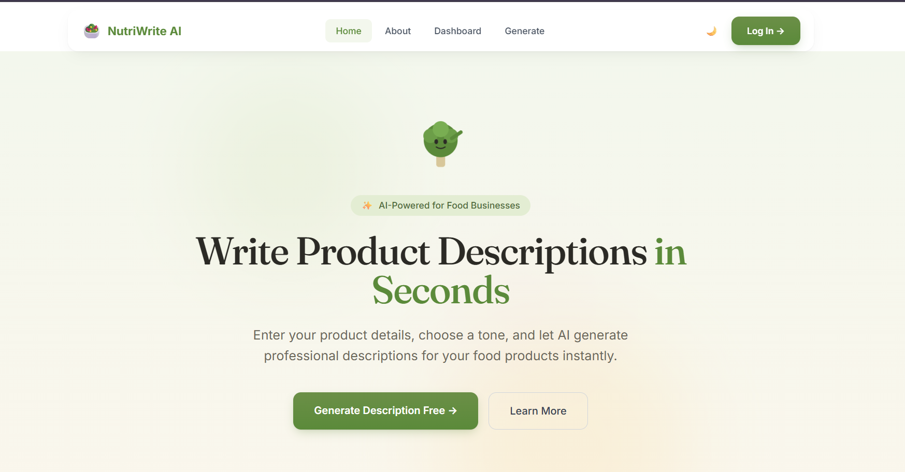
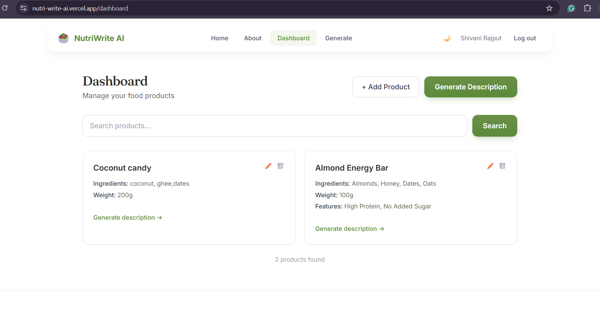
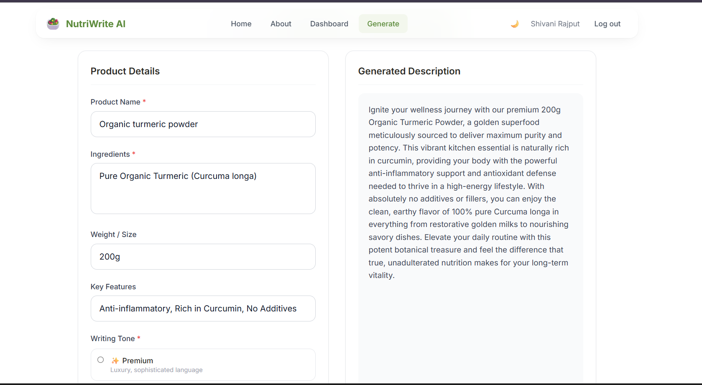
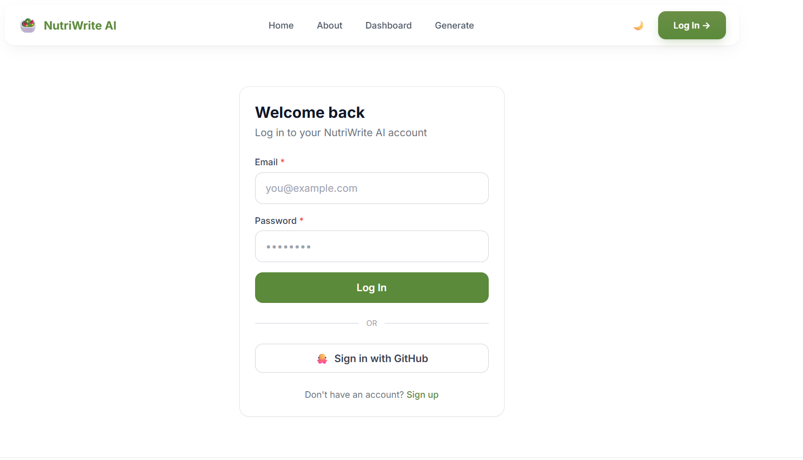

# 🥗 NutriWrite AI

AI-powered product description generator for food businesses — enter a product's details, pick a tone, and get a professional, ready-to-use description in seconds.

---

## 🚀 Live Demo

**App:** [nutri-write-ai.vercel.app](https://nutri-write-ai.vercel.app)


## 📸 Screenshots

| Home | Dashboard |
|---|---|
|  |  |

| Generate | Login |
|---|---|
| | |

> Replace the placeholders above with your actual screenshots — e.g. `` once the images are added to the repo.

---

## ✨ Features

- **AI description generation** — three selectable tones (Premium, Traditional, Health-Focused), each with its own prompt style, powered by Google Gemini
- **Product dashboard** — create, edit, search, and soft-delete products, with undo
- **Regenerate & compare** — re-run a generation and compare against the previous result
- **Authentication** — email/password signup and login, plus GitHub OAuth
- **Generation history** — every AI generation is saved and viewable
- **Dark mode** — full light/dark theme support across the app
- **Responsive design** — works across desktop, tablet, and mobile

---

## 🛠️ Tech Stack

| Layer | Technology |
|---|---|
| Frontend | Next.js 14 (App Router), React 18, Tailwind CSS, Framer Motion |
| Backend | Node.js, Express |
| Database | MongoDB Atlas (Mongoose) |
| AI | Google Gemini (`gemini-3-flash-preview`) |
| Auth | JWT (httpOnly cookies) + Passport.js GitHub OAuth |
| Hosting | Vercel (frontend), Render (backend), MongoDB Atlas (database) |

---

## ⚙️ Setup Instructions

### Prerequisites
- Node.js 18+
- A MongoDB Atlas connection string
- A Google Gemini API key
- A GitHub OAuth App (for GitHub login)

### 1. Clone the repo
```bash
git clone https://github.com/Shivani-360/NutriWrite-AI.git
cd NutriWrite-AI
```

### 2. Backend setup
```bash
cd backend
npm install
cp .env.example .env   # then fill in the values below
npm run dev             # starts on http://localhost:5000
```

**`backend/.env`**
```
PORT=5000
MONGODB_URI=your_mongodb_atlas_connection_string
GEMINI_API_KEY=your_gemini_api_key
JWT_SECRET=a_long_random_string
SESSION_SECRET=a_different_long_random_string
FRONTEND_URL=http://localhost:3000
GITHUB_CLIENT_ID=your_github_oauth_client_id
GITHUB_CLIENT_SECRET=your_github_oauth_client_secret
GITHUB_CALLBACK_URL=http://localhost:5000/api/auth/github/callback
```

### 3. Frontend setup
```bash
cd frontend
npm install
npm run dev              # starts on http://localhost:3000
```

**`frontend/.env.local`** — not required for local dev; the app calls the backend directly via `http://localhost:5000` by default. In production, API calls are proxied through Next.js rewrites (see `next.config.js`), so no public API URL needs to be exposed to the browser.

---

## 📡 API Documentation

Base URL (production): `https://nutriwrite-ai-backend.onrender.com/api`

### Auth
| Method | Endpoint | Description | Auth required |
|---|---|---|---|
| POST | `/auth/register` | Create an account (email, password, name) | No |
| POST | `/auth/login` | Log in with email/password | No |
| POST | `/auth/logout` | Clear the session cookie | No |
| GET | `/auth/me` | Get the current logged-in user | Yes |
| GET | `/auth/github` | Start GitHub OAuth flow | No |
| GET | `/auth/github/callback` | GitHub OAuth callback | No |

### Products
| Method | Endpoint | Description | Auth required |
|---|---|---|---|
| GET | `/products` | List all products (supports `?q=` search) | No |
| GET | `/products/:id` | Get a single product | No |
| POST | `/products` | Create a product | Yes |
| PUT | `/products/:id` | Update a product | Yes |
| DELETE | `/products/:id` | Delete a product | Yes |

### AI Generation
| Method | Endpoint | Description | Auth required |
|---|---|---|---|
| POST | `/generate` | Generate a product description | No (rate-limited) |
| GET | `/generate/history` | View past generations | No |

**Example — `POST /api/generate`**
```json
// Request
{
  "productName": "Organic Honey",
  "ingredients": "100% raw organic honey",
  "weight": "500g",
  "features": "Cold-extracted, single-origin",
  "tone": "premium"
}

// Response
{
  "success": true,
  "description": "Indulge in the golden richness of our single-origin organic honey...",
  "product": { "productName": "Organic Honey", "ingredients": "...", "weight": "500g", "features": "...", "tone": "premium" }
}
```

---

## 🏗️ Architecture / Folder Structure

```
NutriWrite-AI/
├── backend/
│   ├── config/        # DB connection, Passport GitHub strategy
│   ├── middleware/    # auth check, rate limiters
│   ├── models/        # User, Product, GeneratedDescription (Mongoose schemas)
│   ├── routes/        # auth, products, generate
│   ├── validators/    # request validation schemas (Zod)
│   └── server.js      # Express app entry point
└── frontend/
    └── src/
        ├── app/            # Next.js App Router pages (home, about, dashboard, generate, login, register)
        ├── components/     # Navbar, Hero, Card, Sprout (mascot), Footer, etc.
        ├── components/ui/  # Button, Input, Loader, Toast primitives
        └── context/        # AuthContext, ThemeContext
```

**Database schema (MongoDB / Mongoose):**
- **User** — email, hashed password (optional, for OAuth-only accounts), name, GitHub/Google IDs, avatar
- **Product** — name, ingredients, weight, features, timestamps
- **GeneratedDescription** — stores every AI generation (inputs + output + tone) as a permanent history log

MongoDB was chosen because the data here is naturally document-shaped (a product's fields vary in completeness, and each AI generation is really a self-contained record) rather than strictly relational, and Atlas's free tier made it a practical fit for a student project with a tight deployment timeline.

---

## ⚠️ Known Limitations

- **Render free tier cold starts** — the backend spins down after inactivity, so the first request after idle time can take 20-30 seconds.
- **No password reset flow yet** — accounts created with email/password have no "forgot password" option currently.
- **Google OAuth** — the User schema supports it, but only GitHub OAuth is currently wired up end-to-end.

---

## 🙏 Credits & Acknowledgements

- AI generation powered by [Google Gemini](https://ai.google.dev/)
- Built as part of the TBI-GEU internship capstone program
- UI icons and illustrations: custom-built "Sprout" mascot

---

## 📄 License

Built for educational purposes as part of the TBI-GEU internship program.